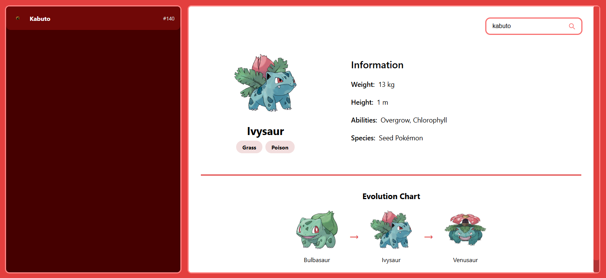

# Pokédex - Midware Technical Test

This project is a Pokédex built using basic web technologies (HTML, CSS, and JavaScript) as part of a technical test.

## General Description

The application allows users to browse a list of Pokémon retrieved from the public [PokeAPI](https://pokeapi.co/).
Users can search for Pokémon by name and view details such as image, types, abilities, height, weight, and evolutionary chain.

## Preview

Below are two screenshots of the application:

### Default view (no Pokémon selected)
This view shows the interface when the page loads, with the Pokémon list on the left and a message prompting the user to select a Pokémon.


### Selected Pokémon with search
This view displays the details after a user searches and selects a Pokémon, showing its stats and additional information.


## User Instructions

1. Open the `index.html` file in a modern web browser (Google Chrome, Firefox, Edge, etc.).
2. Browse the list of available Pokémon in the left sidebar.
3. Use the search bar to find Pokémon by name.
4. Click on any Pokémon to view detailed information.
5. Scroll down to load more Pokémon automatically (infinite scroll).

## Technical Manual

### Project Structure

```
pokedex/
├── index.html              Main application page
├── styles/
│   └── main.css            Custom styles
├── scripts/
│   └── app.js              Main JavaScript logic
├── assets/
│   ├── pokedex-default.png      Default interface screenshot
│   └── pokedex-selected.png     Screenshot with selected Pokémon
└── README.md               Instructions and technical manual
```

### Technologies Used

- HTML5
- CSS3
- JavaScript (ES6)
- API: [PokeAPI](https://pokeapi.co/)

### How to Run the Application Locally

1. Clone the repository or download the project files.
2. Open the `index.html` file directly in a web browser.
3. No additional installations, servers, or dependencies are required.

This project runs entirely in the browser without the need for external configuration.

## Delivery Instructions

1. Upload all project files to a repository on your preferred version control system (e.g., GitHub, GitLab, Bitbucket).
2. Make sure to include this `README.md` file with all relevant instructions.
3. Send the repository link via email as instructed in the test requirements.
